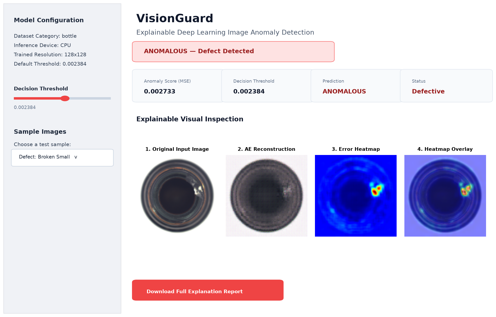

# VisionGuard: Modular Computer Vision & Visual Anomaly Detection

**VisionGuard** is an open-source, modular computer-vision platform for image preprocessing, baseline heuristic anomaly detection, and unsupervised visual defect localization using deep learning (PyTorch).

---

## 1. Architecture & System Overview

VisionGuard is structured into progressive, decoupled layers:

```text
┌────────────────────────────────────────────────────────────────────────┐
│                        VisionGuard Architecture                        │
└────────────────────────────────────────────────────────────────────────┘
                                    │
    ┌───────────────────────────────┴───────────────────────────────┐
    ▼                                                               ▼
[Foundation Layer]                                         [Deep Learning Layer]
- Dataset & I/O Utilities (src/dataset.py)                 - ConvAutoencoder (src/model.py)
  • Supported format validation (.png, .jpg, .webp, etc.)    • Encoder-Decoder compression
  • Corrupted & missing file handling                        • Latent representation learning
  • Directory scanning & PyTorch Dataset                   - Unsupervised Training (src/train.py)
                                                             • Normal-only image training
- Preprocessing Pipeline (src/preprocessing.py)             • Automated threshold calibration
  • Strict RGB conversion (RGBA/L/CMYK)                    - Explainable AI (src/explain.py)
  • Bilinear/Bicubic resizing (H, W)                         • Pixel error heatmaps & Jet overlays
  • Numerical normalization ([0, 1], [-1, 1], ImageNet)   - CLI & Interactive Dashboard
                                                             • Real-time inference (src/detect.py)
- Baseline Anomaly Scorer (src/baseline.py)                  • Streamlit UI (app.py)
  • Heuristic pixel subtraction (MSE/MAE/Peak)
  • Empirical benchmark (NOT a trained ML model)
```

---

## 2. Foundation Components

### A. Image Dataset & I/O Utilities (`src/dataset.py`)
Robust image loading designed to prevent training/inference failures due to faulty data:
- **Format Validation**: Restricts input to supported extensions: `.png`, `.jpg`, `.jpeg`, `.bmp`, `.tiff`, `.webp`. Rejects unsupported files with `UnsupportedImageFormatError`.
- **Missing File Handling**: Gracefully catches missing file paths and raises `ImageNotFoundError`.
- **Corrupted File Detection**: Forces PIL image pixel rasterization (`img.load()`) to catch truncated files or invalid byte headers, raising `CorruptedImageError`.
- **Directory Discovery**: `get_image_paths()` scans directories recursively with optional `validate_readable` filtering.
- **PyTorch Integration**: `ImageDataset` provides seamless integration with PyTorch `DataLoader`.

### B. Preprocessing Pipeline (`src/preprocessing.py`)
Standardizes arbitrary image inputs into unified numerical arrays/tensors:
- **Color Conversion**: `to_rgb()` maps Grayscale (`L`), transparent `RGBA` (composited over white background), or CMYK images into clean 3-channel RGB.
- **Resizing**: `resize_image()` scales images to any `(height, width)` using high-fidelity interpolation (`Resampling.BILINEAR` or `Resampling.BICUBIC`).
- **Normalization**: `normalize_image()` converts images to `float32` within `[0.0, 1.0]` (standard for autoencoders), `[-1.0, 1.0]`, or standard ImageNet statistics.
- **Batch Processing**: `ImagePreprocessor` handles single images or batched arrays `(B, H, W, C)` / PyTorch tensors `(B, C, H, W)`.

### C. Baseline Image-Difference Anomaly Scoring (`src/baseline.py`)
> **IMPORTANT NOTE**: This module implements a **heuristic pixel-difference baseline**, NOT a trained AI/machine learning model.

In computer vision engineering, it is essential to establish an empirical baseline before deploying complex neural networks:
- Computes pixel-wise error: $|I_{\text{test}} - I_{\text{ref}}|$ across chosen metrics (`MSE`, `MAE`, or `Peak`).
- Generates a 2D anomaly heatmap $(H, W)$ highlighting exact pixel discrepancies.
- Computes decision threshold and classifies samples as `NORMAL` or `ANOMALOUS`.
- Serves as the quantitative benchmark that the deep autoencoder must outperform.

---

## 3. Installation & Setup

VisionGuard requires **Python 3.9+** (tested and verified on Python 3.14).

```bash
# Clone the repository
git clone https://github.com/Zuhairsyed123/VisionGuard.git
cd VisionGuard

# Install dependencies
pip install -r requirements.txt
```

### Dependencies
- `torch` & `torchvision`: Deep learning framework and tensor operations.
- `numpy` & `Pillow`: Numerical array manipulation and robust image I/O.
- `scikit-learn`: Performance metrics (ROC-AUC, Precision, Recall, F1-Score).
- `matplotlib` & `opencv-python`: Heatmap color mapping and visualization overlays.
- `streamlit`: Interactive web demonstration dashboard.
- `pytest`: Automated test runner.

---

## 4. Usage Guide

### A. Preprocessing & Dataset Loading (Python API)

```python
from src.dataset import load_image, get_image_paths
from src.preprocessing import ImagePreprocessor

# 1. Safely load an image with corruption verification
img = load_image("path/to/sample.png", mode="RGB")

# 2. Preprocess image into a normalized PyTorch tensor (C, H, W) in [0, 1]
preprocessor = ImagePreprocessor(target_size=(128, 128), range_mode="zero_one", to_tensor=True)
tensor = preprocessor("path/to/sample.png")
print("Preprocessed tensor shape:", tensor.shape)  # torch.Size([3, 128, 128])
```

### B. Baseline Image-Difference Anomaly Scoring (CLI)

Compare a test image against a reference normal template using the heuristic baseline:

```bash
python -m src.baseline \
  --test "data/bottle/test/broken_small/000.png" \
  --reference "data/bottle/test/good/042.png" \
  --metric mse \
  --threshold 0.02 \
  --save-map "outputs/baseline_diff.png"
```

### C. Deep Learning Convolutional Autoencoder (Phase 2)

#### 1. Training the Autoencoder
Train the autoencoder exclusively on normal, defect-free images to learn nominal representations:

```bash
python src/train.py --epochs 20 --batch-size 16 --lr 0.001
```

*(Add `--download` if running for the first time without the MVTec AD dataset pre-downloaded).*

#### 2. Single-Image Anomaly Inference
Run inference to detect defects and generate a 4-panel explainable diagnostic report:

```bash
python src/detect.py --image "data/bottle/test/broken_small/000.png" --save-output "outputs/demo_broken_small.png"
```

#### 3. Quantitative Evaluation
Evaluate ROC-AUC, classification metrics, and score distributions:

```bash
python src/evaluate.py
```

#### 4. Interactive Streamlit Dashboard
Launch the web interface for visual defect inspection:

```bash
streamlit run app.py
```



---

## 5. Running the Test Suite

VisionGuard includes comprehensive automated tests covering dataset utilities, corrupted file handling, preprocessing pipeline, baseline difference scoring, and model architectures.

Execute tests via `pytest`:

```bash
# Run all tests with verbose output
pytest -v

# Run a specific test suite
pytest tests/test_dataset.py -v
pytest tests/test_preprocessing.py -v
pytest tests/test_baseline.py -v
pytest tests/test_pipeline.py -v
```

---

## 6. Limitations of Heuristic Baselines

While simple pixel-difference scoring provides a fast, interpretable benchmark, it has critical limitations that necessitate deep learning:
1. **Misalignment Sensitivity**: Any slight shift, translation, rotation, or scale difference between test and reference images causes high false-positive error.
2. **Lighting Variations**: Ambient illumination shifts trigger global intensity errors even when products are defect-free.
3. **Template Dependency**: Requires an exact golden template or reference image, which is impractical for non-rigid or textured industrial products.

---

## 7. Future Autoencoder Roadmap

To transcend baseline limitations and achieve state-of-the-art anomaly localization:
- **Self-Supervised Autoencoders**: Current Phase 2 architecture learns latent structural distributions invariant to minor pixel translations.
- **Top-k Per-Pixel Loss**: Focuses reconstruction loss on localized defect clusters rather than diluting over whole-image averages.
- **SSIM + L1 Combined Objective**: Preserves high-frequency structural edges and texture fidelity.
- **PatchCore / PaDiM Memory Banks**: Extract patch-level embeddings from pre-trained backbones (ResNet/WideResNet) for industrial-grade (>98% AUROC) detection.
