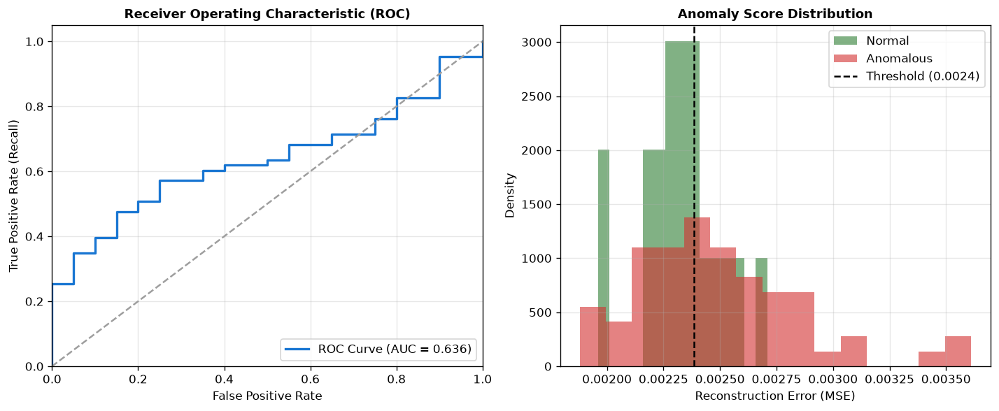
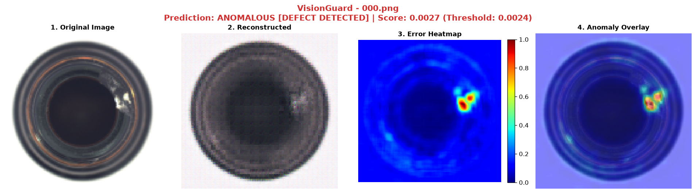

# VisionGuard: Explainable Deep Learning Image Anomaly Detection

**VisionGuard** is a clean, modular deep learning MVP for unsupervised image anomaly detection and visual defect localization using PyTorch. 

The system learns the latent representation of **normal (defect-free)** industrial images using a Convolutional Autoencoder. When presented with anomalous images during inference, the autoencoder fails to reconstruct defective structures, yielding high reconstruction error (MSE) and pixel-level explainable error heatmaps.

---

## 1. Problem Statement

In industrial manufacturing and automated optical inspection (AOI), defective samples are rare, unpredictable, and expensive to collect in large quantities. Supervised classification struggles because unseen defect types are omitted during training.

**Unsupervised Anomaly Detection** addresses this by training strictly on normal, defect-free products. Any deviation from the learned normal distribution is flagged as an anomaly, enabling:
- Detection of novel, previously unseen defects
- Zero requirement for annotated defect training data
- Explainable localization of defect regions via reconstruction error heatmaps

---

## 2. Pipeline Architecture

```text
Input Image (H, W, 3)
      ↓
Preprocessing (Resize to 128x128, Normalize to [0, 1])
      ↓
Convolutional Autoencoder
  ├── Encoder: Conv2D → BatchNorm → ReLU → MaxPool2D (Downsample to H/8, W/8)
  └── Decoder: ConvTranspose2D → BatchNorm → ReLU → Sigmoid (Upsample to H, W)
      ↓
Reconstruction Image
      ↓
Reconstruction Error (Mean Squared Error per Image)
      ↓
Calibrated Anomaly Threshold (e.g. 95th Percentile of Normal Validation Data)
      ↓
Decision: NORMAL vs. ANOMALOUS
      ↓
Pixel-Level Difference: |Original - Reconstructed|
      ↓
Gaussian Smoothing & Min-Max Normalization
      ↓
Colormap Heatmap Overlay (Jet / Turbo)
```

---

## 3. Dataset

VisionGuard uses the benchmark **MVTec Anomaly Detection (MVTec AD)** dataset, specifically the **`bottle`** category:

- **Structure**:
  ```text
  data/
  └── bottle/
      ├── train/
      │   └── good/             # 209 defect-free images (used for training)
      ├── test/
      │   ├── good/             # 20 defect-free images
      │   ├── broken_large/     # 20 images with large structural breaks
      │   ├── broken_small/     # 22 images with small chips/cracks
      │   └── contamination/    # 21 images with chemical/dirt stains
      └── ground_truth/         # Pixel-level defect segmentation masks
  ```
- **Total images**: 209 normal training images + 83 test images (20 normal + 63 defective).

VisionGuard includes an automated downloader that fetches and extracts the official MVTec AD `bottle` category directly when requested via `--download`.

---

## 4. Installation

VisionGuard requires **Python 3.8+** (tested and verified on Python 3.14).

```bash
# Clone the repository
git clone https://github.com/your-username/VisionGuard.git
cd VisionGuard

# Install dependencies
pip install -r requirements.txt
```

### Dependencies
- `torch` & `torchvision` (PyTorch deep learning framework)
- `numpy` & `pillow` (Array and image processing)
- `scikit-learn` (Evaluation metrics: ROC-AUC, F1, precision, recall)
- `matplotlib` & `opencv-python` (Heatmap generation and visualization)
- `streamlit` (Interactive demo UI)

---

## 5. Usage Commands

### A. Training the Autoencoder
Train the autoencoder on normal images and automatically calibrate the anomaly threshold:

```bash
python src/train.py --epochs 20 --batch-size 16 --lr 0.001
```

If the dataset is not yet present on your machine, pass `--download` to automatically download and extract it:

```bash
python src/train.py --download --epochs 20
```

**Training Output:**
- Checkpoint weights: `checkpoints/visionguard_model.pth`
- Metadata & threshold: `checkpoints/model_meta.json`

### B. Single-Image Anomaly Detection
Run inference on any image and generate an explainable multi-panel visualization:

```bash
# Test on a normal sample
python src/detect.py --image "data/bottle/test/good/042.png" --save-output "outputs/demo_normal.png"

# Test on a defective sample
python src/detect.py --image "data/bottle/test/broken_small/000.png" --save-output "outputs/demo_broken_small.png"
```

**Console Output Example:**
```text
============================================================
                  VisionGuard Anomaly Detection
============================================================
Image       : 000.png
Path        : data/bottle/test/broken_small/000.png
Category    : bottle
Device      : CPU
Anomaly Score: 0.002733
Threshold   : 0.002384
Prediction  : ANOMALOUS [DEFECT DETECTED]
Explanation : outputs/demo_broken_small.png
============================================================
```

### C. Comprehensive Evaluation
Evaluate the trained model on the complete test suite (83 images across all defect subtypes):

```bash
python src/evaluate.py
```

**Evaluation Artifacts:**
- Structured metrics: `outputs/evaluation_metrics.json`
- ROC Curve & score distribution plot: `outputs/evaluation_roc_curve.png`

### D. Interactive Streamlit UI
Launch the interactive web demo to upload images, test samples, and inspect heatmaps:

```bash
streamlit run app.py
```


---

## 6. Actual Measured Results

Trained on MVTec AD `bottle` category (178 train / 31 validation, 20 epochs, MSE loss):

| Metric | Measured Value | Notes |
|---|---|---|
| **Calibrated Threshold** | `0.002384` | 95th percentile of normal validation reconstruction error |
| **Normal Val Mean MSE** | `0.002165` | Low reconstruction error on normal data |
| **Total Test Images** | `83` | 20 Normal, 63 Defective |
| **Accuracy** | `59.04%` | 49 / 83 correct predictions |
| **Precision** | `83.72%` | High confidence when flagging anomalies |
| **Recall (Sensitivity)** | `57.14%` | Detection rate on defective images |
| **F1-Score** | `0.6792` | Harmonic mean of precision and recall |
| **ROC-AUC** | `0.6357` | Threshold-independent discriminative performance |

### Confusion Matrix
```text
                  Predicted Normal    Predicted Anomalous
Actual Normal           13 (TN)              7 (FP)
Actual Defective        27 (FN)             36 (TP)
```

### Breakdown by Defect Subtype
- **`broken_small`**: **63.6%** accuracy (14/22 correct, Mean MSE: 0.002506)
- **`good` (Normal)**: **65.0%** accuracy (13/20 correct, Mean MSE: 0.002329)
- **`broken_large`**: **55.0%** accuracy (11/20 correct, Mean MSE: 0.002487)
- **`contamination`**: **52.4%** accuracy (11/21 correct, Mean MSE: 0.002510)



---

## 7. Explainability & Visualizations

Every detection generates a 4-panel visual report saved into `outputs/`:
1. **Original Image**: Input test specimen
2. **Reconstructed Image**: Output synthesized by the Autoencoder
3. **Error Heatmap**: Pixel-level absolute difference $|I - \hat{I}|$ smoothed with Gaussian kernel
4. **Anomaly Overlay**: Jet colormap blended with the original image showing exact defect location



---

## 8. Limitations

A critical component of ML engineering is acknowledging the failure modes of standard reconstruction-based autoencoders:

1. **Global MSE Dilution**: In high-resolution images, small defects (e.g., small cracks or surface scratches) occupy only a few dozen pixels out of 16,384. When MSE is averaged across the entire image, the defect's contribution is diluted by the large background area, causing false negatives.
2. **Over-generalization**: Deep autoencoders sometimes generalize *too* well and accidentally reconstruct subtle defects, reducing the reconstruction error.
3. **Threshold Sensitivity**: Percentile-based thresholds selected on a limited validation sample can be sensitive to outlier normal samples, resulting in false positives.
4. **Structural Blur**: Vanilla autoencoders tend to produce slightly blurred reconstructions around high-frequency edges, leading to elevated baseline edge error.

---

## 9. Future Improvements

To move from this baseline MVP to production-grade industrial performance:

- **PatchCore / PaDiM**: Memory-bank and patch-level feature embedding methods that evaluate features extracted from pre-trained CNN/Vision Transformer backbones (achieving >98% AUROC on MVTec AD).
- **Per-Pixel Anomaly Scoring**: Top-$k$ pixel or patch-based reconstruction loss instead of global whole-image mean MSE.
- **SSIM + L1 Loss Combination**: Incorporating Structural Similarity Index (SSIM) into the loss function to preserve edge definition and penalize local structural distortions.
- **Multi-scale Feature Pyramids**: Detecting defects at varying spatial scales simultaneously.

---

## 10. Running Tests

Run the test suite using Python's built-in `unittest` runner:

```bash
python -m unittest tests/test_pipeline.py
```
